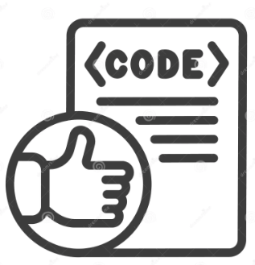

### Coding Consistency: A Linguist's Approach

When I first encountered coding standards, they reminded me of my earlier days as a translator. Back then, CAT (Computer-Assisted Translation) tools were not just conveniences—they were essentials. They ensured that no matter how many different projects I worked on or how many tweaks a client requested, I stayed consistent in my translation. It was a matter of professional survival to ensure the same phrase was translated in exactly the same way every time. Little did I know, years later, I’d be applying this same approach and precision to software engineering. 

### ESLint as a Guide, Not a Burden

Enter ESLint, the tool that some might see as a pain, pestering you to fix seemingly insignificant errors, but I see it as a trusty sidekick. Just as CAT tools helped me navigate the nuances of language, ESLint helps me adhere to the “grammar” of JavaScript. It's like learning Mandarin — there’s an initial frustration when you trip over set phrases or stumble through syntax. But after using it for a week, I can see how ESLint is doing something more than just pointing out trivialities. It's guiding me toward mastering the language of code itself. Far from being a burden, ESLint reinforces good practices at the minor expense of a little time. Fixing those errors feels like refining the accuracy and consistency of a translation, which has helped me understand how the language (in this case, TypeScript) is structured.

Coding standards are more than just rules about where to put a brace. They are, at their core, about consistency. Without them, your code can easily devolve into an unintelligible pile of words that others would be hard-pressed to understand — much like how inconsistent terminology can confuse readers of a translated text. They ensure that everyone speaks the same language.

### A Painful but Productive Process

Now, that’s not to say that it’s always fun. If I'm being honest, getting rid of ESLint errors sometimes felt like splitting hairs. At first, it’s a slow process where it feels like there is no end in sight. But, much like those long nights I spent adjusting translations for consistency, the process is ultimately worth it. It’s the kind of pain that leads to growth. As I clean up ESLint errors, my code is getting clearer, more readable, and easier to maintain. This mirrors the way consistent translations lead to better readability and understanding for the target audience.

### Conclusion

In both translation and software engineering, consistency is key. Tools like ESLint and VSCode are the modern-day equivalents of the CAT tools I once relied on as a translator. They help me adhere to standards, ensuring that my code, like a well-translated document, is clear, consistent, and comprehensible to others. While the process of getting rid of ESLint errors might be painstaking at times, it's also one of the most productive ways to learn and improve. And much like learning a new language, there’s a sense of satisfaction that comes from finally “getting it right.”
