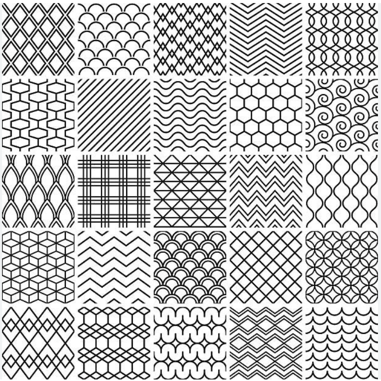
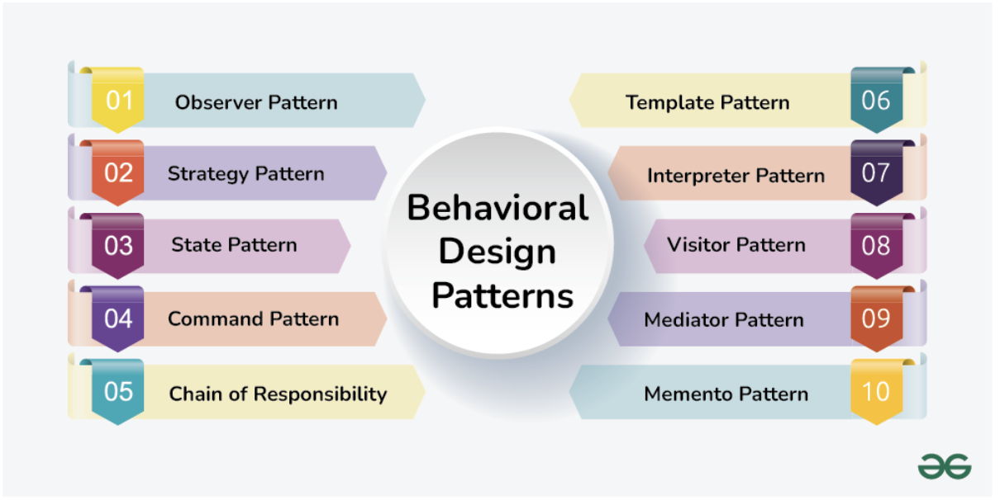

### Sweet Baby Jesus, Here We Go Again
Well, well, well. We meet again on the interwebs. Here I am writing about patterns meant to design how we, as mere simpletons, ought to structure our code, so as to emulate the transcendence of our programming forefathers. And there *you* are, wondering just how in the hell you came into the unsavory position of having to read (and potentially grade) this abomination.

But let's take a step back.

What is the meaning of all this? No, I don't mean life; that would be too easy, a piece of cake. Rather, the question I hope to answer is: why is it I have to write another essay? Of course, I won't answer that question. I did say I "hope", after all, and what is "hope" if not what this class crushes out of you one, mind-numbing essay at a time? I would have "hoped" this class involved more programming and fewer opportunities for students to drivel on about topics with which they clearly are not familiar. Yet even so, if you were among elite squad of ICS 314 students already practiced in the art of software engineering, what need have you to write about it? (Well, presumably to get a non-existent writing intensive credit).

### Cue: Smooth Transition
Before I get too cynical, I ought to commence the obligatory checking of the boxes (to pad my grade):
1. Some relevant words: MVC is a thing. A very good thing. I like this thing. We've been using this thing all along.
2. Some critical thinking: We should have started learning design patterns a month ago, so we weren't running around like a bunch of, well, students.
3. Some pretty pictures (guess which one is more relevant):

  
  

