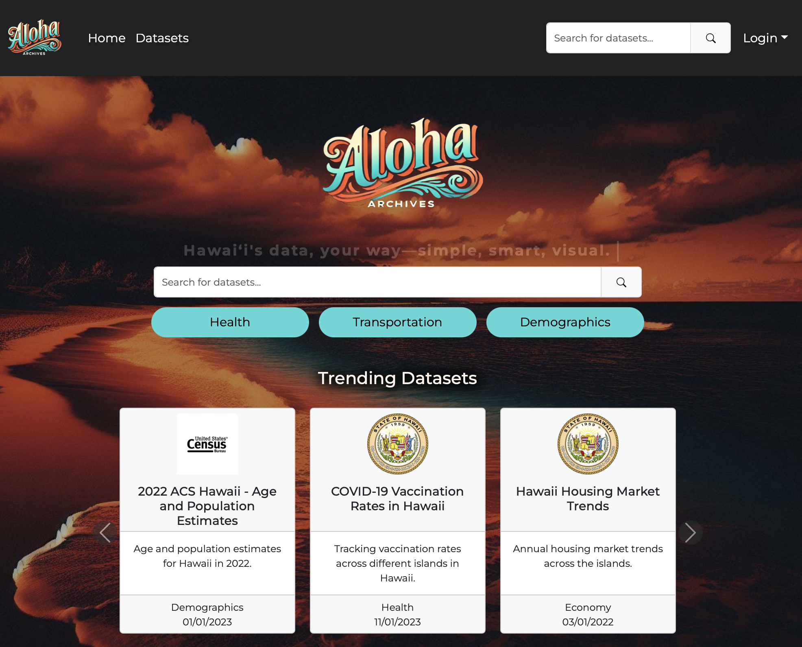

### Barely Hacking It
Shortly after the kickoff of the 2024 Hawai'i Annual Code Challenge, I formed a team from my Intro to Software Engineering class to see if we could tackle one of the open challenges. Due to our own "greenness," I chose what I hoped would be one of the simpler challenges: creating a web portal to replace the State of Hawai'i's open data portal. Despite having a month to complete the project, we did not produce something I would consider award-worthy. Even so, it was a valuable experience where I learned how to manage a project and a team, all while cramming as much future class content as possible to make up for our lack of experience.

During the first two weeks of the challenge, we focused on nailing down some of the bigger-picture details: What should the portal's main functions be? Who would do what (and when)? And how would we even work collectively on a programming project when none of us had ever used GitHub collaboratively? I took my role as seriously as I could, given my workload and secret identity as a stay-at-home dad. I was responsible for ensuring, to the best of my ability, that we were moving forward each week by assigning tasks, discussing each person's time commitment expectations, and managing morale when we felt like we were getting nowhere.

In the end, after several long nights of frantically trying to check all the boxes to ensure we at least submitted something, we successfully moved on to the next stage of presenting. Knowing I had gotten us all into this mess—and that the timing couldn't have been worse with midterms—I spent several days figuring out how to distill our project into a 2-minute presentation (and memorizing my pitch). It wasn't easy, and I won't lie—it wasn't fun. But I don't regret trying. The end product wasn't ideal, but I felt an odd sense of pride in our team. Despite not only learning our tech stack on the spot but also figuring out what software engineering even is, we made something functional. More importantly, we had the courage to present, knowing full well that everyone in the room was a more accomplished software engineer than us.

[Link to Our Deployed Project](http://aloha-archives.vercel.app)
