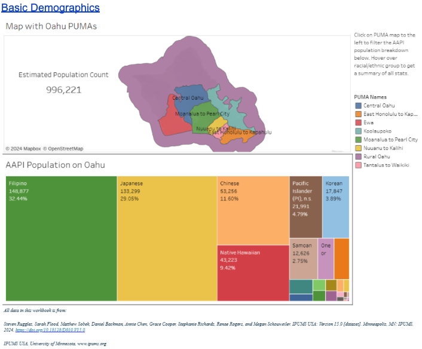

As part of my internship at the City and County of Honolulu's Office of Economic Revitalization (OER), I was tasked with identifying areas in Oahu where there exists economic, linguistic, and educational inequities that might inhibit the economic mobility of those living there. Thanks to the vague nature of my assignment and my own "greenness", the journey to get to a workable analysis was not straightforward. In generally, it involved four steps: research, data exploration, data visualization, data presentaiton.

### Research
I first began with researching previous studies and data, but realized later with a meeting with my superiors that they lacked granularity -- specifically with regards to the Asian and Pacific Islander population on the island. This led me to attempt to replicate the analyses of these studies by going straight to the data sources. It was then that I discovered the US Census Bureau provided annual data samples of the American Community Survey. While I later learned how to extract the sample (Public Use Microdata Sample, PUMS) from the Census Bureau's API, at the time, the best I knew how to do was extract the data from IPUMS, who provide a simple interface to select samples and variable for extraction. Regardless, I had finally found my dataset.

### Exploration
With the PUMS data, I spent several weeks not only understanding what the variables were, but how other researchers use them to draw conclusions about a population. There are hundreds of variables (in this context, answers to the survey questions), with each of them having their own codes for the responses, so this was one of the most time-consuming parts of the project.

### Visualization
Exploration of the data continued as I learned how to visualize the data in Tableau. Thanks to my student status, I was able to get a one-year subscription to Tableau Desktop, which allowed me to do GIS analysis (not an option on the free version). Through countless hours of trial and error, I learned how to apply useful Tableau "Calculated Fields" to not only transform the data (mostly from number codes to actual text), but also to perform simple calculations that are common in Census data such as the percent of the population that is limited English proficiency or the percent of the population 25 years old or older who have attended higher education institutions. I then learned how to not only make the maps of Oahu interactive, but a little easier to read through better color coding. As someone who had not done too much visualization before this point, this was definitely my favorite stage of the project.

### Presentaiton
Throughout the duration of the project, I had several meetings with stakehoders of varying seniority at OER. However, the most interesting meeting was an in-person presentation to Councilmember Matt Weter at his office along with the Executive Director of OER, Amy Asselbaye. Having spent several years as a teacher in China, I did not feel especially nervous. In fact, having spent so long silently plugging away at the data, I invited the chance to explain everything I had found. Being able to present my report to people who can make the change was a rewarding experience.

The report is as follows:

# Community Equity Liaison Background Research
**Date:** July 31, 2024  

## Executive Summary

Based on the 2022 American Community Survey (ACS) Public-Use Microdata Sample (PUMS) sourced from IPUMS USA, we recommend the Community Equity Liaison team focus on areas facing significant challenges in language proficiency, educational attainment, healthcare access, homeownership, employment, and economic mobility (as indicated by supplementary income, food stamp, and Medicaid recipiency). Our findings aim to guide OER in planning the team's scope of work to enhance upward mobility and access to basic city services.

## Summary and Justification

- **Kalihi Community Liaison:** Targeting the community struggling with language barriers, healthcare access, and college education. This area also receives the most supplementary income and food stamps.
- **Rural Oahu Community Liaison:** Focusing on recent immigrants facing language barriers, low education rates, lack of healthcare coverage, and severe economic challenges, including the lowest average total income and homeownership rate on Oahu.
- **Central Oahu Community Liaison:** Addressing the community receiving significant supplementary income and having high rates of food stamp recipiency and Medicaid coverage.

## Community Equity Liaison Designations 

We recommend the following community equity liaison designations based on data analysis:

### Kalihi Community Liaison

**Key Categories:**
- **Language:** Increase access to interpretation services and English education to reduce linguistic isolation (13.9% of households) and limited English proficiency (LEP) (26.3% of people). Special focus on the Chinese community (62.6% LEP, 31.6% linguistically isolated).
- **Economic stability:** Create jobs and business opportunities to address high Medicaid participation (27.6%), per capita supplemental security income (SSI) ($442), and food stamp recipiency (27.8%).
- **Healthcare:** Increase health insurance awareness and access to reduce the uninsured rate (6.2%), especially among the Chinese (16.7% uninsured).
- **Citizenship:** Provide resources and workshops to help obtain citizenship, reducing the non-citizen percentage (15.7%). The vast majority of non-citizens in this PUMA are Filipino (36.7%).
- **Unemployment:** Offer job training and employment assistance to lower the unemployment rate (4.2%).
- **Education:** Increase access to quality higher education to decrease the percentage of those 25+ years old without any college education (36.8%).

### Rural Oahu Community Liaison

**Key Categories:**
- **Education:** Improve access to higher education to reduce the percentage of those 25+ years old without college education (24.9%).
- **Healthcare:** Increase health insurance awareness and access to reduce the uninsured rate (4.0%).
- **Economic stability:** Focus on job creation and business opportunities to address high Medicaid (28.7%) and food stamp recipiency (25.1%).
- **Homeownership:** Connect to affordable housing programs to address low homeownership (44.7%).
- **Unemployment:** Provide job training and employment assistance to lower the unemployment rate (4.1%).
- **Language:** Increase interpretation services and English education for the Pacific Islander community (79.3% LEP, 43.9% linguistically isolated).
- **Citizenship:** Provide resources and workshops to help obtain citizenship, reducing the non-citizen percentage of Pacific Islanders (46.4%) and Filipinos (27.6%).

### Central Oahu Community Liaison

**Key Categories:**
- **Healthcare:** Increase health insurance awareness and access to reduce the uninsured rate, especially among Pacific Islanders (14.6%).
- **Language:** Enhance access to interpretation services and English education to help Filipinos who are LEP (26.4%) and reduce linguistic isolation (7.2%).
- **Economic stability:** Focus on job creation and business opportunities to address high Medicaid (17.3%) and per capita SSI ($393).
- **Education:** Improve access to higher education to reduce the percentage of Native Hawaiians 25+ years old without college education (46.3%).

[Tableau Visualizations](https://public.tableau.com/views/PUMADemographics/BasicDemographics?:language=en-US&:sid=&:redirect=auth&:display_count=n&:origin=viz_share_link)
